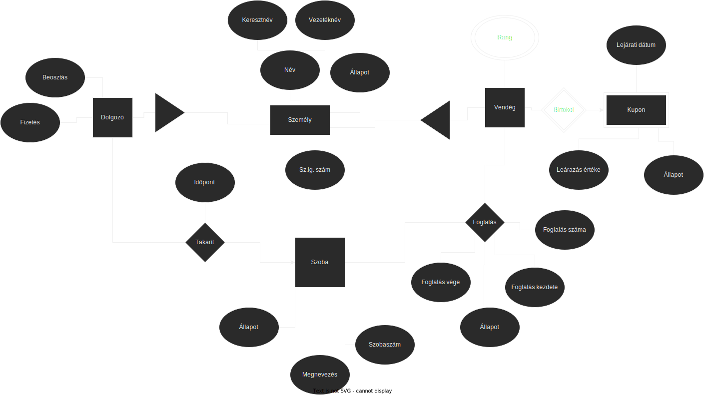

# Szálloda projekt dokumentáció 2022

## Összefoglaló

Ebben a projektben egy hotel nyilvántartási webes alkalmazást fogok PHP, MySQL és Bootstrap alapokra felépíteni.

### Rendszerspecifikáció

A rendszernek képesnek kell lennie arra, hogy a cég takarítói, vendégei és foglalásai nyilvántartását végezhessék benne.

### Funkciók

TODO: részletesebben leírni

- foglalások kezelése
  - ki mikorra, melyik szobát foglalta le
  - foglalás állapotának követése: megjelent, kijeletnkezett, aktív, stb.
- Vendégek adatainak nyilvántartása
  - Név, sz. ig szám tárolása és szerkesztése
  - Foglalásaik megtekintése
- Szobák nyilvántartása
  - Létre lehet hozni, szerkeszteni és törölni őket
  - Meg lehet nézni mikor lettek legutóbb kitakarítva és éppen lakik e valaki bennük
- Takarítók nyilvántartása
  - A takarítók adatait el lehet tárolni, szerekeszteni vagy törölni az adatbázisban
  - Meg lehet nézni és be lehet állítani, mikor és mit takarított az adott takarító

### Egyed-kapcsolat diagram

### Egyed-kapcsolat leírása

TODO: részletesebben leírni

- Terek tábla adattagjai:
  - Kód (szoba száma)
  - Megnevezés
  - Állapot
- Szoba tábla (Terek tábla specializációja) adattagjai:
- Személy tábla adattagjai:
  - Név:
    - Keresztnév
    - Vezetéknév
  - Sz.ig szám
  - Állapot
- Vendég tábla (Személy tábla specializációja) adattagjai:
  - Rang
- Dolgozók tábla (Személy tábla specializációja) adattagjai:
  - Fizetés
  - Beosztás
- Takarító tábla
- Foglalás tábla adattagjai
  - Foglalás kezdete
  - Foglalás vége
  - Állapot (Aktív, nem jelent meg, kijelentkezett)
- Takarítások kapcsolat a szobák és a dolgozók között. Adattagjai:
  - Mikor takarít

### Egyed-kapcsolat diagram leképezése relációs adatbázissémákká
Személy(Keresztnév, Vezetéknév, *<u>Személyi igazolvány szám</u>*, Személy állapota)

Vendég(<u>Személyi igazolvány szám</u>, Vendég állapota)

Rang(<u>Személyi igazolvány szám</u>, Rang megnevezése)

Dolgozó(<u>Személyi igazolvány szám</u>, Dolgozó állapota, Dolgozó beosztása, Dolgozó fizetése)

Kupon(<u>Lejárati dátum</u>, <u>Leárazás értéke</u>, <u>Tulajdonos</u>, Kupon állapota)

Szoba(<u>Szobaszám</u>, Megnevezés, Szoba állapota, Legutóbbi takarító, Legutóbbi takarítás időpontja)

Foglalás(*<u>Foglalás száma</u>*, *Szobaszám*, Foglalás kezdete, Foglalás vége, Foglalás állapota)

Foglaló(<u>Foglalás száma</u>, <u>Személyi igazolvány szám</u>)

### Relációs adatbázissémákk normalizálása

TODO: rájönni a többértékű attribútumok függőségeit hogyan kellene jelölni 

#### Funkcionális függőségek:

1. {Személyi igazolvány szám} -> {Vendég állapota, Személy állapota, Keresztnév, Vezetéknév, Dolgozó állapota, Dolgozó beosztása, Dolgozó fizetése, Rang megnevezése}

2. {Szobaszám} -> {Megnevezés, Szoba állapota, Legutóbbi takarító, Legutóbbi takarítás időpontja}

3. {Foglalás száma} -> {Szobaszám, Foglalás kezdete, Foglalás vége, Foglalás állapota, Személyi igazolvány szám}

4. {Lejárati dátum, Leárazás értéke, Tulajdonos} -> {Kupon állapota}

5. {Személyi igazolvány szám, Keresztnév} -> {Vezetéknév, Személy állapota}

6. {Személyi igazolvány szám, Dolgozó beosztása} -> {Dolgozó fizetése, Dolgozó állapota}

7. {Foglalás száma, Szobaszám} -> {Foglalás kezdete, Foglalás vége,  Foglalás állapota}

8. {Személyi igazolvány szám, Rang megnevezése} -> {Rang megnevezése}

#### Összes attribútum egy táblában:

R(Személyi igazolvány szám, Keresztnév, Vezetéknév, Személy állapota, Vendég állapota, Rang megnevezése, Dolgozó állapota, Dolgozó beosztása, Dolgozó fizetése, Lejárati dátum, Leárazás értéke, Tulajdonos, Kupon állapota, Szobaszám, Megnevezés, Szoba állapota, Legutóbbi takarító, Legutóbbi takarítás időpontja, Foglalás száma, Foglalás kezdete, Foglalás vége, Foglalás állapota, Személyi igazolvány szám)

#### Kulcsok:

{Személyi igazolvány szám, Szobaszám, Foglalás száma, Lejárati dátum, Leárazás értéke, Tulajdonos}

#### 2NF

##### 1., 2. és 3. függőség feloldása:

R(*<u>Személyi igazolvány szám</u>*, *<u>Foglalás száma</u>*, <u>Lejárati dátum</u>, <u>Leárazás értéke</u>, <u>Tulajdonos</u>, Kupon állapota)

R1(<u>Személyi igazolvány szám</u>, Vendég állapota, Személy állapota, Keresztnév, Vezetéknév, Dolgozó állapota, Dolgozó beosztása, Dolgozó fizetése, Rang megnevezése)

R2(<u>Szobaszám</u>, Megnevezés, Szoba állapota, Legutóbbi takarító, Legutóbbi takarítás időpontja)

R3(<u>Foglalás száma</u>, *Szobaszám*, Foglalás kezdete, Foglalás vége, Foglalás állapota, Személyi igazolvány szám)

##### 4. függőség feloldása:

R(*<u>Személyi igazolvány szám</u>*, *<u>Foglalás száma</u>*)

R1(<u>Személyi igazolvány szám</u>, Vendég állapota, Személy állapota, Keresztnév, Vezetéknév, Dolgozó állapota, Dolgozó beosztása, Dolgozó fizetése, Rang megnevezése)

R2(<u>Szobaszám</u>, Megnevezés, Szoba állapota, Legutóbbi takarító, Legutóbbi takarítás időpontja)

R3(<u>Foglalás száma</u>, *Szobaszám*, Foglalás kezdete, Foglalás vége, Foglalás állapota, Személyi igazolvány szám)

R4(<u>Lejárati dátum</u>, <u>Leárazás értéke</u>, <u>Tulajdonos</u>, Kupon állapota)

##### 5., 6., 7. függőség feloldása:

R(*<u>Személyi igazolvány szám</u>*, *<u>Foglalás száma</u>*)

R1(<u>Személyi igazolvány szám</u>, Vendég állapota, Rang megnevezése)

R2(<u>Szobaszám</u>, Megnevezés, Szoba állapota, Legutóbbi takarító, Legutóbbi takarítás időpontja)

R4(<u>Lejárati dátum</u>, <u>Leárazás értéke</u>, <u>Tulajdonos</u>, Kupon állapota)

R5(Keresztnév, Vezetéknév, <u>Személyi igazolvány szám</u>, Személy állapota)

R6(<u>Személyi igazolvány szám</u>, Dolgozó állapota, Dolgozó beosztása, Dolgozó fizetése)

R7(<u>Foglalás száma</u>, *Szobaszám*, Foglalás kezdete, Foglalás vége, Foglalás állapota)

##### 8. függőség feloldása:

R(*<u>Személyi igazolvány szám</u>*, *<u>Foglalás száma</u>*)

R1(<u>Személyi igazolvány szám</u>, Vendég állapota)

R2(<u>Szobaszám</u>, Megnevezés, Szoba állapota, Legutóbbi takarító, Legutóbbi takarítás időpontja)

R4(<u>Lejárati dátum</u>, <u>Leárazás értéke</u>, <u>Tulajdonos</u>, Kupon állapota)

R5(Keresztnév, Vezetéknév, <u>Személyi igazolvány szám</u>, Személy állapota)

R6(<u>Személyi igazolvány szám</u>, Dolgozó állapota, Dolgozó beosztása, Dolgozó fizetése)

R7(<u>Foglalás száma</u>, *Szobaszám*, Foglalás kezdete, Foglalás vége, Foglalás állapota)

R8(<u>Személyi igazolvány szám</u>, Rang megnevezése)

##### Átnevezve:

Foglaló(*<u>Személyi igazolvány szám</u>*, *<u>Foglalás száma</u>*)

Vendég(<u>Személyi igazolvány szám</u>, Vendég állapota)

Szoba(<u>Szobaszám</u>, Megnevezés, Szoba állapota, Legutóbbi takarító, Legutóbbi takarítás időpontja)

Kupon(<u>Lejárati dátum</u>, <u>Leárazás értéke</u>, <u>Tulajdonos</u>, Kupon állapota)

Személy(Keresztnév, Vezetéknév, <u>Személyi igazolvány szám</u>, Személy állapota)

Dolgozó(<u>Személyi igazolvány szám</u>, Dolgozó állapota, Dolgozó beosztása, Dolgozó fizetése)

Foglalás(<u>Foglalás száma</u>, *Szobaszám*, Foglalás kezdete, Foglalás vége, Foglalás állapota)

Rang(<u>Személyi igazolvány szám</u>, Rang megnevezése)

#### 3NF

Már 3NF-ben van. mivel minden másodlagos attribútuma közvetlenül függ bármely kulcstól.

### Tábla tervek

TODO:

### Összetett lekírdezések

TODO:

## Technológia

A projekt a következő technológiákat/szoftvereket fogja használni a munka során:

- Egyszerű CloudLinux alapú Cpanel webtárhely MySQL adatbázissal
- PHP (backend)
- Bootstrap (frontend)
- Github szoftverprojekt menedzselő szolgáltatás
- VSCode IDE
- Git verziókövető (Github)

### webalkalmazás futtatása

TODO: Leírni hogyan kell elindítani a webalkalmazást

## A munka tartalma

### Követelmények

- min. 4 tábla
- MYSQL adatbázis kezelő rendszer
- min. 50 demó rekord összesen
  - Minden táblában legyen rekord
- CRUD
- legalább 3 összetett lekérdezés

#### A programhoz a tervezési dokumentáció az alábbiakat tartalmazza:

- A feladat megnevezése
- A feladat specifikációja, leírása
- Egyed-kapcsolat diagram és az egyed-kapcsolat diagram értelmezésének leírása
- Egyed-kapcsolat diagram leképezése relációs adatbázissémákká
- Relációsémák normalizálása 3NF-ig. (Amennyiben egy-egy séma esetén indokolt, a normalizálást elegendő csupán 2NF-ig megcsinálni).
- Táblatervek (a relációsémák alapján)
- Az összetett lekérdezések, amelyek az alkalmazásban is meg vannak valósítva.
- Megvalósítás (fejlesztő eszközök, nemtriviális megoldások).
- Az elkészült alkalmazás funkciói (legalább felsorolás szintjén)

### Átadandók és határidők

A főbb átadandók és határidők a projekt időtartama alatt a következők:

| Szállítandó |             Neve             | Határideje |
| :---------: | :--------------------------: | :--------: |
|      D      |  Projektterv és dokuentáció  | 2022-10-15 |
|     P+D     | Kész program és dokumentáció | 2022-11-27 |

D - dokumentáció, P - prototípus

### Verziók

| Verzió | Dátum        | Státusz  | Megjegyzés     |
| ------ | ------------ | -------- | -------------- |
| 0.1    | `2021-09-26` | Tervezet | Legelső verzió |

Státusz osztályozás:

- Tervezet: befejezetlen dokumentum, a mérföldkő leadása előtti napokban
- Előterjesztés: a projekt menedzser bírálatával, a mérföldkő határidejekor
- Elfogadott: a megrendelő által elfogadva, a prezentáció bemutatásakor

Szeged, 2022-10-15.
