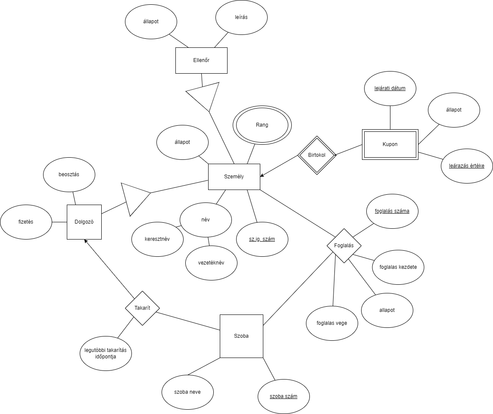

# Szálloda adatbázis projekt dokumentáció

- Név: Barna Gergely
- Neptun kód: FJKXGG
- H-s azonosító: H144988

## Rendszerspecifikáció

Ebben a projektben egy hotel nyilvántartási webes alkalmazást fogok PHP és MySQL alapokra felépíteni.

A rendszernek képesnek kell lennie arra, hogy a cég takarítói, vendégei, ellenőrei és foglalásai nyilvántartását végezessék benne.

### Funkciók

- Személlyek nyilvántartása
  - Lehessen nyilvántartást vezetni a hotelben megfordult emberekről
  - Tárolanó adatok: név, sz.ig. száma, Állapot, Rang
  - Lehessen személyeket létrehozni, módosítani és törölni
  - A személyeknek lehessen rangot adni (egyszerre akár több rangja is lehessen egy személynek)
  - A személyket meg lehessen tekinteni egy listában és rendezni adataik alapján
- Dolgozók nyilvántartása
  - A dolgozók legyenek speciális személyek, akikről több adatot tárolunk
  - Tárolanó adatok: a személy adatain felül beosztás és fizetés
  - Lehessen személyeket létrehozni, módosítani és törölni
  - Ha a dolgozóhoz tartozó személyt töröljük, törlődjön a dolgozó is
- Ellenőrök nyilvántartása
  - Az ellenörök legyenek speciális személyek, akikről több adatot tárolunk
  - Tárolanó adatok: a személy adatain felül ellenőr állapota, leírás
  - Lehessen ellenőröket létrehozni, módosítani és törölni
  - Az ellenőrök leírásába be lehessen írni egy hoszabb szöveget az ellenőrről.
  - Ha az ellenőrhöz tartozó személyt töröljük, törlődjön az ellenőr is
- Szobák nyilvántartása
  - Az adatbázisban tároljuk el a hotelben lévő szobákat és néhány adatot róluk
  - Tárolanó adatok: szobaszám, Szoba neve, Ki takarította utoljára, Mikor takarították utoljára
  - Lehessen szobákat létrehozni, módosítani és törölni
  - Minden szobánál meg lehessen adni melyik dolgozó és mikor takarította legutóbb a szobát
- Foglalások nyilvántartása
  - Követni lehessen ki, mikorra és melyik szobát foglalta le.
  - Tárolanó adatok: Foglalás száma, Foglalt szoba, Foglaló személy, Foglalás kezdeti dátuma, Foglalás vég dátuma, Foglalás állapota
  - Lehessen foglalásokat létrehozni, módosítani és törölni
  - Lehessen egy szobát egy időpontban több személynek is kiadni
  - Egy személy egy időpontra akár több szobát is lefoglalhasson
  - Be lehessen állítani a foglalások állapotát

### Technológia

A projekt a következő technológiákat/szoftvereket fogja használni a munka során:

- Egyszerű CloudLinux alapú Cpanel webtárhely MySQL adatbázissal
- PHP (backend)
- Bootstrap (frontend)
- Github szoftverprojekt menedzselő szolgáltatás
- VSCode IDE
- Git verziókövető (Github)

## Egyed-kapcsolat diagram



### Egyed-kapcsolat diagram leírása

Az hogy az egyes tábláknak milyen attribútumaik vannak vagy vagy hogy épp mi a nevük, szerintem teljesen egyértelmű, ezért nem fogom most újra leírni. A következő párszáz sor ezt taglalja, most foglalkozzunk inkább az izgalmasabb jelölésekkel.

A Személy táblának van egy több értékű attribútuma, amely leképezés után egy külön táblába fog kerülni. Ennek hála egy személynek egyszerre akár több rangja is lehet. E mellett van egy összetett attribútuma is (név), amelynek részattribútumai kerülnek csak bele leképezésnél a táblába.

A Kupon gyenge egyed egy meghatározó kapcsolaton keresztül megkapja leképezésnél a személy kulcsát, ami nékül nem lehetne egyértelműen hivatkozni rekordjaira (nem lenne pontos kulcsa).

Az Ellenőr és a Dolgozó a Személy specializációja. Úgy döntöttem a rendundancia elkerülése végett leképezésnél a szülő kulcsát veszem hozzá a gyerek attribútumaihoz. Ez lassítja és összetettebé teszi a gyerekek összes adatának lekérdezését, cserébe kisebb helyet foglal (Tegyünk úgy mintha számítana egy ekkora adatbázinál a méret).

A Foglalás egy N:M kapcsolat, szóval külön táblát kap leképezésnél (nem lehet össze vonni) attribútumaival és a két összekapcsolt tábla kulcsával.

A Takarít egy 1:M kapcsolat az az az M oldali táblával összevonható, így abba fognak bele olvadni attribútumai és a másik tábla kulcsa leképezéskor.

### Egyed-kapcsolat diagram leképezése koszolidált relációs adatbázissémákká

Személy(Keresztnév, Vezetéknév, <u>Személyi igazolvány szám</u>, Személy állapota)

Ellenőr(_<u>Személyi igazolvány szám</u>_, Ellenőr állapota, Leírás)

Dolgozó(_<u>Személyi igazolvány szám</u>_, beosztás, fizetés)

Rang(_<u>Személyi igazolvány szám</u>_, Rang név)

Kupon(<u>Lejárati dátum</u>, <u>Leárazás értéke</u>, _<u>Tulajdonos</u>_, Állapot)

Szoba(<u>Szobaszám</u>, Szoba név, _Legutóbbi takarító_, Legutóbbi takarítás időpontja)

Foglalás(<u>Foglalás száma</u>, _Szobaszám_, Foglalás kezdete, Foglalás vége, Foglalás állapota, _Foglaló személy_)

### Relációs adatbázissémák normalizálása

#### Funkcionális függőségek:

Személy:

{Személyi igazolvány szám} -> {Keresztnév, Vezetéknév, Személy állapota}

{Személyi igazolvány szám, Keresztnév} -> {Vezetéknév, Személy állapota}

{Személyi igazolvány szám, Személy állapota} -> {Vezetéknév, Keresztnév}

{Személyi igazolvány szám, Vezetéknév} -> {Személy állapota, Keresztnév}

{Személyi igazolvány szám, Keresztnév, Vezetéknév} -> {Személy állapota}

{Személyi igazolvány szám, Keresztnév, Személy állapota} -> {Vezetéknév}

{Személyi igazolvány szám, Vezetéknév, Személy állapota} -> {Keresztnév}

<br/>

Ellenőr:

{Személyi igazolvány szám} -> {Ellenőr állapota, Leírás}

{Személyi igazolvány szám, Ellenőr állapota} -> {Leírás}

{Személyi igazolvány szám, Leírás} -> {Ellenőr állapota}

{Személyi igazolvány szám, Beosztás} -> {Fizetés}

{Személyi igazolvány szám, Fizetés} -> {Beosztás}

<br/>

Rang: 

A táblának minden attribútuma kulcs is, ezért kicsit furán néz ki a függősége. Lényegében saját mahát határozza meg.

{Személyi igazolvány szám, Rang név} -> {Rang név}

<br/>

Kupon:

{Lejárati dátum, Leárazás értéke, Tulajdonos} -> {Állapot}

<br/>

Szoba:

{Szobaszám} -> {Szoba név, Legutóbbi takarító, Legutóbbi takarítás időpontja}

{Szobaszám, Szoba név} -> {Legutóbbi takarító, Legutóbbi takarítás időpontja}

{Szobaszám, Legutóbbi takarító} -> {Szoba név, Legutóbbi takarítás időpontja}

{Szobaszám, Legutóbbi takarítás időpontja} -> {Szoba név, Legutóbbi takarító}

{Szobaszám, Szoba név, Legutóbbi takarító} -> {Legutóbbi takarítás időpontja}

{Szobaszám, Szoba név, Legutóbbi takarítás időpontja} -> {Legutóbbi takarító}

{Szobaszám, Legutóbbi takarító, Legutóbbi takarítás időpontja} -> {Szoba név}

<br/>

Foglalás:

{Foglalás száma} -> {Szobaszám, Foglalás kezdete, Foglalás vége, Foglalás állapota, Foglaló személy}

{Foglalás száma, Szobaszám} -> {Foglalás kezdete, Foglalás vége, Foglalás állapota, Foglaló személy}

{Foglalás száma, Foglalás kezdete} -> {Szobaszám, Foglalás vége, Foglalás állapota, Foglaló személy}

{Foglalás száma, Foglalás vége} -> {Szobaszám, Foglalás kezdete, Foglalás állapota, Foglaló személy}

{Foglalás száma, Foglalás állapota} -> {Szobaszám, Foglalás kezdete, Foglalás vége, Foglaló személy}

{Foglalás száma, Foglaló személy} -> {Szobaszám, Foglalás kezdete, Foglalás vége, Foglalás állapota}

{Foglalás száma, Szobaszám, Foglalás kezdete} -> {Foglalás vége, Foglalás állapota, Foglaló személy}

{Foglalás száma, Szobaszám, Foglalás vége} -> {Foglalás kezdete, Foglalás állapota, Foglaló személy}

{Foglalás száma, Szobaszám, Foglalás állapota} -> {Foglalás kezdete, Foglalás vége, Foglaló személy}

{Foglalás száma, Szobaszám, Foglaló személy} -> {Foglalás kezdete, Foglalás vége, Foglalás állapota}

{Foglalás száma, Foglalás kezdete, Foglalás vége} -> {Szobaszám, Foglalás állapota, Foglaló személy}

{Foglalás száma, Foglalás kezdete, Foglalás állapota} -> {Szobaszám, Foglalás vége, Foglaló személy}

{Foglalás száma, Foglalás kezdete, Foglaló személy} -> {Szobaszám, Foglalás vége, Foglalás állapota}

{Foglalás száma, Foglalás vége, Foglalás állapota} -> {Szobaszám, Foglalás kezdete, Foglaló személy}

{Foglalás száma, Foglalás vége, Foglaló személy} -> {Szobaszám, Foglalás kezdete, Foglalás állapota}

{Foglalás száma, Foglalás állapota, Foglaló személy} -> {Szobaszám, Foglalás kezdete, Foglalás vége}

{Foglalás száma, Szobaszám, Foglalás kezdete, Foglalás vége} -> {Foglalás állapota, Foglaló személy}

{Foglalás száma, Szobaszám, Foglalás kezdete, Foglalás állapota} -> {Foglalás vége, Foglaló személy}

{Foglalás száma, Szobaszám, Foglalás kezdete, Foglaló személy} -> {Foglalás vége, Foglalás állapota}

{Foglalás száma, Szobaszám, Foglalás vége, Foglalás állapota} -> {Foglalás kezdete, Foglaló személy}

{Foglalás száma, Szobaszám, Foglalás vége, Foglaló személy} -> {Foglalás kezdete, Foglalás állapota}

{Foglalás száma, Szobaszám, Foglalás állapota, Foglaló személy} -> {Foglalás kezdete, Foglalás vége}

... - Had ne írjam ki az összeset ehhez a táblához. Lényegében a kulcs (Foglalás száma) után bármilyen atribútumot fűzűnk, meg fogja határozni a tábla többi attribútumát.

<br/>

Ha elvonatkoztatok a példa megoldástól és elkezdek gondolkodni, simán kijön, hogy két esélyes kulcsa van a foglalás táblának (na jó 3, de kettő lényegében ugyan az):

{Foglalás száma} -> {Szobaszám, Foglalás kezdete, Foglalás vége, Foglalás állapota, Foglaló személy} _--- a foglalás számát lényegében kulcsnak terveztem, nem csoda hát hogy egyértelműen meghatározza a tábla összes többi attribútumát. Ezt használtam később is kulcsnak, mert ő a legegyszerűbb._

{Szobaszám, Foglalás kezdete, Foglaló személy} -> {Foglalás vége, Foglalás állapota, Foglalás száma} _--- Egy szobát egy személy egy időben nem bérelhet ki kétszer (legalábbis nem lenne értelme, ezért felételezem hogy nem gond, ha nem teheti meg), ezért akár ez is lehetne kulcs_

{Szobaszám, Foglalás vége, Foglaló személy} -> {Foglalás kezdete, Foglalás állapota, Foglalás száma} _--- Ugyan ez érvényesül, ha a foglalás végét vesszük kulcsnak akkor is._

_Bármi ami ezeknél bővebb nem lehet kulcs, mert ezek szűkebbek nála, ezért nincs is értelme foglalkozni vele._

#### Kulcsok

Külső kulcs más néven: idegen kulcs, Foreign key

Személy(Keresztnév, Vezetéknév, <u>Személyi igazolvány szám</u>, Személy állapota)

- Kulcs: Személyi igazolvány szám
  - Ez a legszűkebb halmaz, amelynek lezártja visszaadja a teljes attribútumhalmazt.

Ellenőr(_<u>Személyi igazolvány szám</u>_, Ellenőr állapota, Leírás)

- Kulcs: Személyi igazolvány szám
  - Ez a legszűkebb halmaz, amelynek lezártja visszaadja a teljes attribútumhalmazt.
- Külső kulcs: Személyi igazolvány szám
  - Személy tábla elsődleges kulcsára hivatkozik

Dolgozó(_<u>Személyi igazolvány szám</u>_, beosztás, fizetés)

- Kulcs: Személyi igazolvány szám
  - Ez a legszűkebb halmaz, amelynek lezártja visszaadja a teljes attribútumhalmazt.
- Külső kulcs: Személyi igazolvány szám
  - Személy tábla elsődleges kulcsára hivatkozik

Rang(_<u>Személyi igazolvány szám</u>_, Rang név)

- Kulcs: Személyi igazolvány szám
  - Ez a legszűkebb halmaz, amelynek lezártja visszaadja a teljes attribútumhalmazt.
- Külső kulcs: Személyi igazolvány szám
  - Személy tábla elsődleges kulcsára hivatkozik

Kupon(<u>Lejárati dátum</u>, <u>Leárazás értéke</u>, _<u>Tulajdonos</u>_, Állapot)

- Kulcs: Lejárati dátum, Leárazás értéke, Tulajdonos
  - Ez a legszűkebb halmaz, amelynek lezártja visszaadja a teljes attribútumhalmazt.
- Külső kulcs: Tulajdonos
  - Személy tábla elsődleges kulcsára hivatkozik

Szoba(<u>Szobaszám</u>, Szoba név, _Legutóbbi takarító_, Legutóbbi takarítás időpontja)

- Kulcs: Szobaszám
  - Ez a legszűkebb halmaz, amelynek lezártja visszaadja a teljes attribútumhalmazt.
- Külső kulcs: Legutóbbi takarító
  - Dolgozó tábla elsődleges kulcsára hivatkozik

Foglalás(<u>Foglalás száma</u>, _Szobaszám_, Foglalás kezdete, Foglalás vége, Foglalás állapota, _Foglaló személy_)

- Kulcs: Foglalás száma
  - Ez a legszűkebb halmaz, amelynek lezártja visszaadja a teljes attribútumhalmazt.
- Külső kulcs: Szobaszám
  - Szoba tábla elsődleges kulcsára hivatkozik
- Külső kulcs: Foglaló személy
  - Személy tábla elsődleges kulcsára hivatkozik

### Normalizálás

Minden tábla 3NF-ben lett a lekípezés után, így nem igazán tudok normalizálni.

A minden táblán belül minden másodlagos attribútum atomi, teljesen függ bármely kulcstól és nincs tranzitív függés az attribútumok között, az az 3NF-ben van minden tábla.

Normalizáltság bizonyítása után a séma ugyan olyan maradt:

Személy(Keresztnév, Vezetéknév, <u>Személyi igazolvány szám</u>, Személy állapota)

Ellenőr(_<u>Személyi igazolvány szám</u>_, Ellenőr állapota, Leírás)

Dolgozó(_<u>Személyi igazolvány szám</u>_, beosztás, fizetés)

Rang(_<u>Személyi igazolvány szám</u>_, Rang név)

Kupon(<u>Lejárati dátum</u>, <u>Leárazás értéke</u>, _<u>Tulajdonos</u>_, Állapot)

Szoba(<u>Szobaszám</u>, Szoba név, _Legutóbbi takarító_, Legutóbbi takarítás időpontja)

Foglalás(<u>Foglalás száma</u>, _Szobaszám_, Foglalás kezdete, Foglalás vége, Foglalás állapota, _Foglaló személy_)

## Tábla tervek


Nem tudom ilyen tábla terv kellett e, ezért a dokumentum legaljára bemásoltam a tábla, kulcs és külső kulcs létrehozó SQL-t is.

## Összetett lekérdezések

### 1) Legutóbb takarított szoba(k):

```
SELECT szoba.szobaszam, szoba.nev, MIN(szoba.legutobbitakaritasidopontja)
FROM szoba
GROUP BY szoba.szobaszam, szoba.nev
HAVING MIN(szoba.legutobbitakaritasidopontja) = (
  SELECT MIN(legregebbi)
  FROM (
    SELECT szoba.szobaszam, MIN(szoba.legutobbitakaritasidopontja) AS legregebbi
    FROM szoba
    GROUP BY szoba.szobaszam
  ) as x
)
```

### 2) Legtöbbet foglalt személy(ek):

```
SELECT vezeteknev, keresztnev, szemelyiigazolvanyszam FROM szemely
WHERE szemelyiigazolvanyszam
IN (
    SELECT foglaloszemely
    FROM (
        SELECT foglaloszemely, COUNT(*) AS darab
        FROM foglalas
        GROUP BY foglaloszemely
        having count(*) = (
            SELECT max(x.darab)
            FROM (
                SELECT foglaloszemely, COUNT(*) AS darab
                FROM foglalas
                GROUP BY foglaloszemely
            ) as x
        )
    )  as xy
)
```

### 3) Jelenleg szabad szobák száma:

```
SELECT COUNT(*) as uresszobakszama
FROM szoba
WHERE szoba.szobaszam IN (
  SELECT foglalas.szobaszam
    FROM foglalas
    WHERE CURRENT_DATE BETWEEN foglalaskezdete AND foglalasvege
)
```

### 4) Legkevesebbet kereső dolgozó(k):

```
SELECT vezeteknev, keresztnev, dolgozo.szemelyiigazolvanyszam
FROM dolgozo
LEFT OUTER JOIN szemely ON szemely.szemelyiigazolvanyszam = dolgozo.szemelyiigazolvanyszam
WHERE fizetes = (
  SELECT MIN(fizetes) FROM dolgozo
)
```

### 5) Legtöbbet kereső dolgozó(k):

```
SELECT vezeteknev, keresztnev, dolgozo.szemelyiigazolvanyszam
FROM dolgozo
LEFT OUTER JOIN szemely ON szemely.szemelyiigazolvanyszam = dolgozo.szemelyiigazolvanyszam
WHERE fizetes = (
  SELECT MAX(fizetes) FROM dolgozo
)
```

### 6) Foglalások listázása (Foglalás kezdetének ideje szerint rendezve):

```
SELECT foglalasszama, foglalas.szobaszam, nev, foglalaskezdete, foglalasvege, foglalasallapota, foglaloszemely, szemely.keresztnev, szemely.vezeteknev
FROM foglalas
LEFT OUTER JOIN szoba ON foglalas.szobaszam = szoba.szobaszam
LEFT OUTER JOIN szemely ON foglalas.foglaloszemely = szemely.szemelyiigazolvanyszam
ORDER BY foglalaskezdete
```

### 7) Dolgozók listázása (Név szerint rendezve):

```
SELECT keresztnev, vezeteknev, szemelyallapota, szemely.szemelyiigazolvanyszam, beosztas, fizetes
FROM szemely
RIGHT OUTER JOIN dolgozo ON szemely.szemelyiigazolvanyszam = dolgozo.szemelyiigazolvanyszam
ORDER BY keresztnev, vezeteknev
```

## Tábla, kulcs, külső kulcs létrehozó SQL utasítássorozat

```
CREATE TABLE `dolgozo` (
  `szemelyiigazolvanyszam` int(32) NOT NULL,
  `beosztas` varchar(32) COLLATE utf8_hungarian_ci DEFAULT NULL,
  `fizetes` int(16) DEFAULT NULL
) ENGINE=InnoDB DEFAULT CHARSET=utf8 COLLATE=utf8_hungarian_ci;

CREATE TABLE `ellenor` (
  `szemelyiigazolvanyszam` int(32) NOT NULL,
  `ellenorallapota` varchar(32) COLLATE utf8_hungarian_ci DEFAULT NULL,
  `leiras` text COLLATE utf8_hungarian_ci DEFAULT NULL
) ENGINE=InnoDB DEFAULT CHARSET=utf8 COLLATE=utf8_hungarian_ci;

CREATE TABLE `foglalas` (
  `foglalasszama` int(11) NOT NULL,
  `szobaszam` int(4) DEFAULT NULL,
  `foglalaskezdete` date DEFAULT NULL,
  `foglalasvege` date DEFAULT NULL,
  `foglalasallapota` varchar(32) COLLATE utf8_hungarian_ci DEFAULT NULL,
  `foglaloszemely` int(32) DEFAULT NULL
) ENGINE=InnoDB DEFAULT CHARSET=utf8 COLLATE=utf8_hungarian_ci;

CREATE TABLE `kupon` (
  `lejaratidatum` date NOT NULL,
  `learazaserteke` int(2) NOT NULL,
  `tulajdonos` int(32) NOT NULL,
  `allapot` varchar(16) COLLATE utf8_hungarian_ci DEFAULT NULL
) ENGINE=InnoDB DEFAULT CHARSET=utf8 COLLATE=utf8_hungarian_ci;

CREATE TABLE `rang` (
  `nev` varchar(32) COLLATE utf8_hungarian_ci NOT NULL,
  `szemelyiigazolvanyszam` int(32) NOT NULL
) ENGINE=InnoDB DEFAULT CHARSET=utf8 COLLATE=utf8_hungarian_ci;

CREATE TABLE `szemely` (
  `keresztnev` varchar(128) COLLATE utf8_hungarian_ci DEFAULT NULL,
  `vezeteknev` varchar(128) COLLATE utf8_hungarian_ci DEFAULT NULL,
  `szemelyallapota` varchar(32) COLLATE utf8_hungarian_ci DEFAULT NULL,
  `szemelyiigazolvanyszam` int(32) NOT NULL
) ENGINE=InnoDB DEFAULT CHARSET=utf8 COLLATE=utf8_hungarian_ci;

CREATE TABLE `szoba` (
  `szobaszam` int(4) NOT NULL,
  `nev` varchar(32) COLLATE utf8_hungarian_ci DEFAULT NULL,
  `legutobbitakarito` int(32) DEFAULT NULL,
  `legutobbitakaritasidopontja` datetime DEFAULT NULL
) ENGINE=InnoDB DEFAULT CHARSET=utf8 COLLATE=utf8_hungarian_ci;


ALTER TABLE `dolgozo`
  ADD PRIMARY KEY (`szemelyiigazolvanyszam`);

ALTER TABLE `ellenor`
  ADD PRIMARY KEY (`szemelyiigazolvanyszam`);

ALTER TABLE `foglalas`
  ADD PRIMARY KEY (`foglalasszama`),
  ADD KEY `szobaFoglal` (`szobaszam`),
  ADD KEY `szemelyFoglal` (`foglaloszemely`);

ALTER TABLE `kupon`
  ADD PRIMARY KEY (`lejaratidatum`,`learazaserteke`,`tulajdonos`),
  ADD KEY `kuponBirtokol` (`tulajdonos`);

ALTER TABLE `rang`
  ADD PRIMARY KEY (`nev`,`szemelyiigazolvanyszam`) USING BTREE,
  ADD KEY `rangjaVan` (`szemelyiigazolvanyszam`);

ALTER TABLE `szemely`
  ADD PRIMARY KEY (`szemelyiigazolvanyszam`);

ALTER TABLE `szoba`
  ADD PRIMARY KEY (`szobaszam`),
  ADD KEY `takarit` (`legutobbitakarito`);


ALTER TABLE `foglalas`
  MODIFY `foglalasszama` int(11) NOT NULL AUTO_INCREMENT;


ALTER TABLE `dolgozo`
  ADD CONSTRAINT `Dolgozo_bovit` FOREIGN KEY (`szemelyiigazolvanyszam`) REFERENCES `szemely` (`szemelyiigazolvanyszam`) ON DELETE CASCADE ON UPDATE CASCADE;

ALTER TABLE `ellenor`
  ADD CONSTRAINT `ellenorBovit` FOREIGN KEY (`szemelyiigazolvanyszam`) REFERENCES `szemely` (`szemelyiigazolvanyszam`) ON DELETE CASCADE ON UPDATE CASCADE;

ALTER TABLE `foglalas`
  ADD CONSTRAINT `szemelyFoglal` FOREIGN KEY (`foglaloszemely`) REFERENCES `szemely` (`szemelyiigazolvanyszam`) ON DELETE CASCADE ON UPDATE CASCADE,
  ADD CONSTRAINT `szobaFoglal` FOREIGN KEY (`szobaszam`) REFERENCES `szoba` (`szobaszam`) ON DELETE CASCADE ON UPDATE CASCADE;

ALTER TABLE `kupon`
  ADD CONSTRAINT `kuponBirtokol` FOREIGN KEY (`tulajdonos`) REFERENCES `szemely` (`szemelyiigazolvanyszam`) ON DELETE CASCADE ON UPDATE CASCADE;

ALTER TABLE `rang`
  ADD CONSTRAINT `rangjaVan` FOREIGN KEY (`szemelyiigazolvanyszam`) REFERENCES `szemely` (`szemelyiigazolvanyszam`) ON DELETE CASCADE ON UPDATE CASCADE;

ALTER TABLE `szoba`
  ADD CONSTRAINT `takarit` FOREIGN KEY (`legutobbitakarito`) REFERENCES `dolgozo` (`szemelyiigazolvanyszam`) ON DELETE SET NULL ON UPDATE CASCADE;
COMMIT;
```

Szeged, 2022-11-24.
